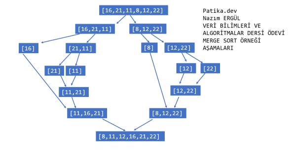

# Project 12
```python
# Author : NAZIM ERGUL
# Date & Time : 15.03.2023 22:47
# Description : Veri Yapıları ve Algoritmalar - Merge Sort Projesi
```
## Merge Sort

- Array =  [16, 21, 11, 8, 12, 22]

#### Question 1 : Yukarı verilen dizinin sort  türüne göre aşamalarını yazınız.
#



Yukarıda yer alan görselde soruda verilen dizinin merge sort aşamaları görsel bir şekilde açıklanmıştır.

#### Question 1 : Big-O gösterimini yazınız.
#

> O(nlogn) Şeklinde gösterilir.

### Method
#


### Example python code
#
```
def merge(sol, sag):
	if not len(sol) or not len(sag):
		return sol or sag
	sonuc = []
	i, j = 0, 0
	while (len(sonuc) < len(sol) + len(sag)):
		if sol[i] < sag[j]:
			sonuc.append(sol[i])
			i+= 1
		else:
			sonuc.append(sag[j])
			j+= 1
		if i == len(sol) or j == len(sag):
			sonuc.extend(sol[i:] or sag[j:])
			break 
	return sonuc
def mergesort(arr):
	if len(arr) < 2:
		return arr
	orta = len(arr)//2
	sol = mergesort(arr[:orta])
	sag = mergesort(arr[orta:])
	return merge(sol, sag)

MyArr = [16,21,11,8,12,22]

MergeArr = mergesort(MyArr)
```
